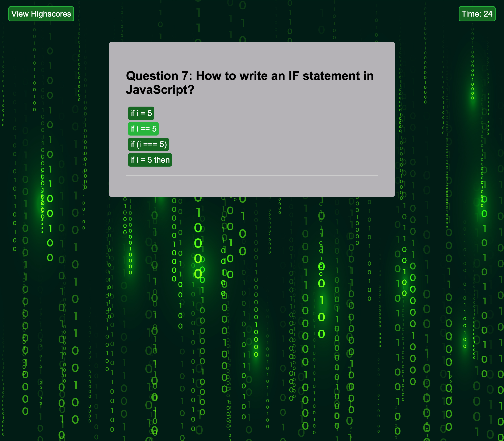
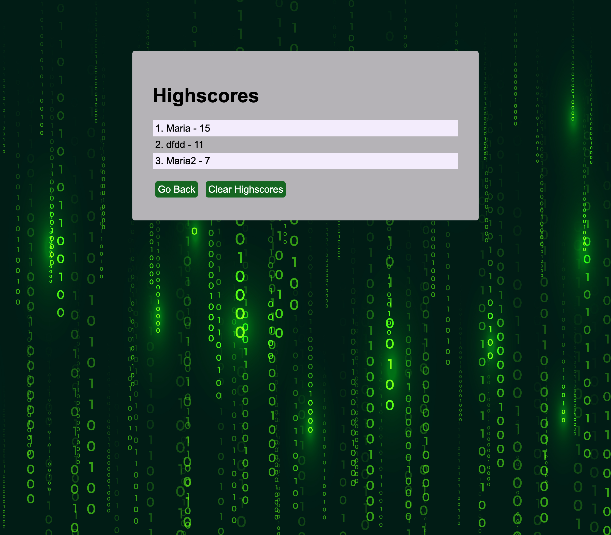

# Code Quiz

## Description
Since I learnt the concepts of DOM, Vanilla JS, and local storage, my task is to apply the new skills and create a timed coding quiz with multiple-choice questions. 
This app runs in the browser, and features a dynamically updated HTML and CSS powered by JavaScript code. It has a clean, polished, and responsive user interface. 

## User Story 
- AS A learner developer
- I WANT to take a timed quiz on JavaScript fundamentals that stores high scores
- SO THAT I can revise the main concepts of JS

## Acceptance Criteria
The criteria I need to take into account are the following:

- A start button that when clicked a timer starts and the first question appears.
  - Questions contain buttons for each answer.
  - When answer is clicked, the next question appears.
  - If the answer clicked was incorrect then subtract time from the clock.
- The quiz should end when all questions are answered or the timer reaches 0.
  - When the game ends, it should display their score and give the user the ability to save their initials and their score.
 
## A link to the deployed application
https://yuzbamaria.github.io/Code_Quiz/

## Screenshots of the application

## License 
MIT License

